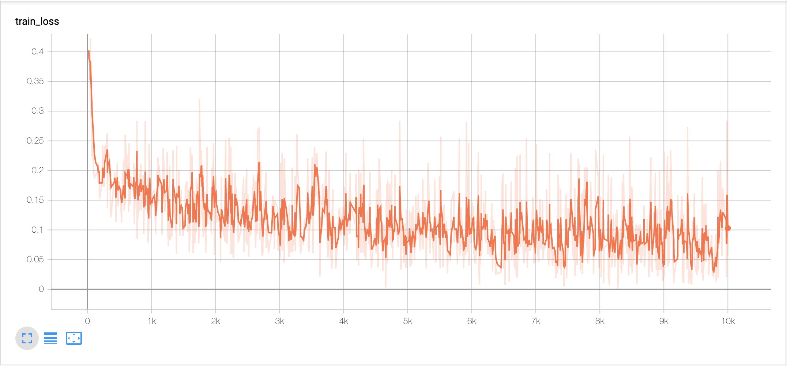
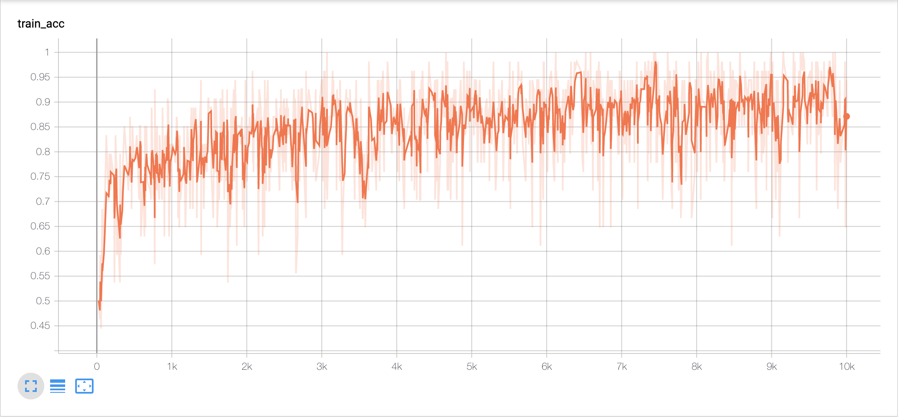
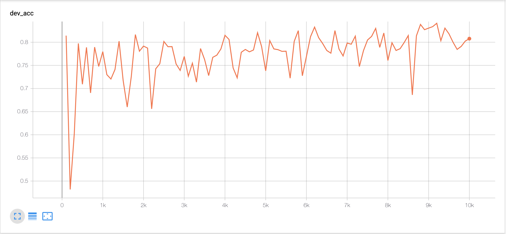

# few-shot-learning

Few-shot learning on binary text classification with Word2Vec weights initialization

## Few-shot Classification

* Few-shot classification is a task in which a classifier must be adapted 
to accommodate new classes not seen in training, 
given only a few examples of each of these new classes. 
* There is a large labeled training set with a set of classes. 
However, after training, the ultimate goal is to produce classifiers 
on the test set (a disjoint set of new classes), 
for which only a small labeled support set will be available. 
* If the support set contains K labeled examples for each of the C unique classes, 
the target few-shot problem is called __C-way K-shot problem__. 
* Usually, the K is too small to train a supervised classification model. 
Therefore meta-learning on the training set is necessary, 
in order to extract transferable knowledge 
that will help classify the test set more successfully.

## Prerequisites

* Install the required packages by:
```angular2
pip install -r requirements.txt
```

## Parameters

* All the parameters are defined in `config.ini`.
* `configparser` is used to parse the parameters.

## Dataset: Amazon Review Sentiment Classification (ARSC)

* The dataset comprises English reviews for 23 types of products
on Amazon. 
* For each product domain, there are three
different binary classification tasks. These buckets then form
23 x 3 = 69 tasks in total. 
* 4 x 3 = 12 tasks from 4 domains (Books, DVD, Electronics and Kitchen) are selected as test domains, 
and there are only 5 examples as support set for each labels in the test domains.
 
| Train Tasks | Dev Tasks|Test Tasks|
| ------| ------|------|
| 19 * 3 = 57 | 4 * 3 = 12 |4 * 3 = 12 |

* Therefore, __2-way 5-shot__ learning model is needed to classify this dataset.

### Download

* Download [Gorov/DiverseFewShot_Amazon](https://github.com/Gorov/DiverseFewShot_Amazon)
* The text files are in `Amazon_few_shot` folder.

### Process

```angular2
python data.py
```

* Train data: `*.train` files in train domains.
Dev data: `*.trian` files in test domains as support data and `*.dev` files in test domains as query data.
Test data: `*.trian` files in test domains as support data and `*.test` files in test domains as query data.

* Pre-process all the texts data.

* Extract vocabulary with train data. Vocabulary has size of 35913, with 0 as `<pad>` and 1 as `<unk>`.

* Index all the texts with the vocabulary.

* Training batch composition: 5 negative support data + 5 positive support data + 27 negative query data + 27 positive query data.
As this is a 2-way 5-shot problem, the 2-ways means the amount of labels (negative/positive) and the 5-shot means the size of support data with the same label.

* Dev batch composition: 5 negative support data + 5 positive support data + 54 query data. There are 183 batches in total.
* Test batch composition: 5 negative support data + 5 positive support data + 54 query data. There are 181 batches in total.

* Above all, the batch size is always 64.

### Word2Vec

```angular2
python word2vec.py
```

* It is hard to train without Word2Vec weights initialization! Therefore Word2Vec weights are necessary!
* Train Word2Vec model with texts in train data, 95584 texts in total.
* Get the weights of the Word2Vec model.
* Load the weights in the encoder module.

### Reference

[Diverse Few-Shot Text Classification with Multiple Metrics](https://arxiv.org/abs/1805.07513v1)

## Model

* Encoder Module: bi-direction recurrent neural network with self-attention.
* Induction Module: dynamic routing induction algorithm.
* Relation Module: measure the correlation between each pair of query and class and output the relation scores.

## Training

```angularjs
export CUDA_VISIBLE_DEVICES=1
python main.py
```

* Training Strategy: episode-based meta training
* Dev while training and record dev accuracy.
* Pick the checkpoint with the highest dev accuracy as the best model and test on it.

## Result

```angularjs
tensorboard --logdir=log/
```

| Train Loss | Train Accuracy |
| ------| ------|
|  |  |

| Dev Accuracy (achieved the highest __0.8410__ on episode 9200)|Test Accuracy (on episode 9200) |
| ------|------|
|  |__0.8452__ |

## Reference
[Few-Shot Text Classification with Induction Network](https://arxiv.org/abs/1902.10482)

## Author
Zhongyu Chen
